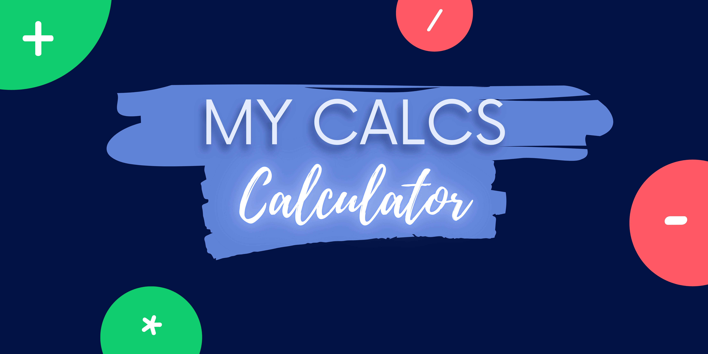
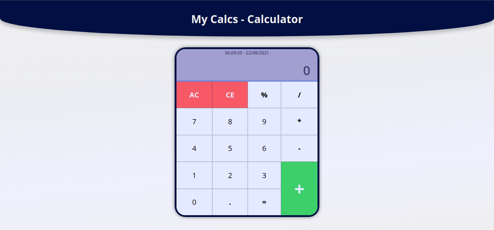
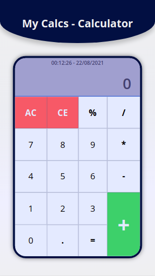

<!-- # My Calcs - Calculator :1234: -->
### :1234: A Calculator Web-App in Javascript, HTML and CSS :1234:

 

## :page_facing_up: About
[My Calcs - Calculator](https://github.com/arthur-david) is a mini calculator project that was designed and created to practice the basic knowledge I gained in HTML, CSS, Javascript and MVC design pattern.

* The site supports keyboard events, mainly the copy and paste function.
* This calculator shows the current date and time
* This calculator provides sound functionality when a key is pressed or when calculator buttons click. To activate or deactivate this functionality, just double-click on the "AC" button.

## :art: Layout
### Web:

### Mobile:

## 🛠 Technologies

As seguintes ferramentas foram usadas na construção do projeto:

- [HTML](https://html.spec.whatwg.org/multipage/)
- [CSS](https://www.w3.org/Style/CSS/Overview.en.html)
- [Javascript](https://www.javascript.com/)

## Autor

<a href="https://github.com/arthur-david">
 
  
 <b>Arthur David</b></a>

Created with dedication by Arthur David ❤️ Contact me 👋🏽!

 
